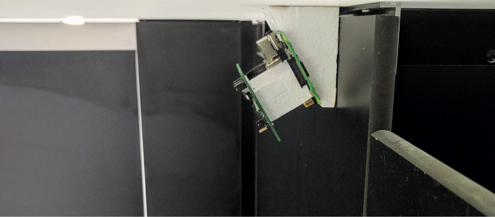
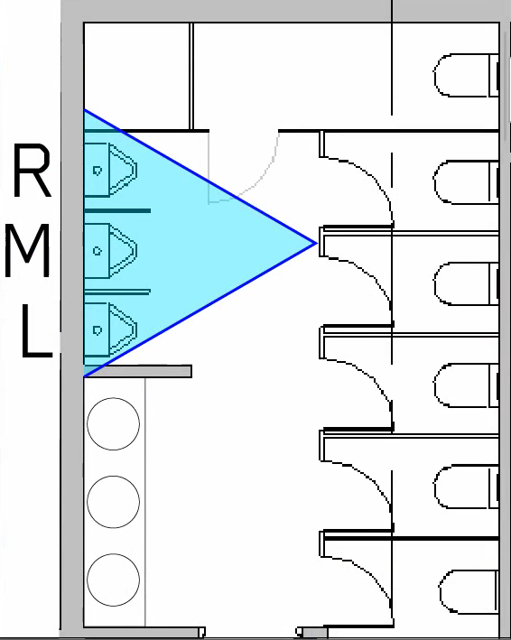

## Tl;dr.
We measured how urinals get used at BVN. We found that people, more or less, follow the obvious rules, but with some nuance. We also found that human bladders seem to empty at the same rate as other mammal bladders.
We’d like this to be a demonstration of how evidence can be used to develop design guidelines, and use it as a template for other situations.

In the world of walking-path mapping, there’s always been a tension between dropping a lot of ca$h on a thermal camera and trying to figure out some sort of way to infer it for a bit less money. There’s a new sensor from Panasonic that seems to do that. It’s an 8×8 thermal camera. Just to make that clear, that’s 64 pixels, not megapixels! That means that we can stick them in sensitive locations without any fear of capturing anything that we need to worry about. This is perfect for places like schools, or changing rooms… or toilets.
There’s a pretty well-established set of rules about where men stand at urinals. You can take a test to see how well you conform to the reported norms, or you can read about what others have written about this complex and deep topic. The problem with all this analysis is that it’s reported, it’s what people say they do. If you’ve been following the thread of my posts over the years, you’ll know that I’m never satisfied with that!
So, we’ve got two things driving us here:
We’ve got a new bit of hardware that we want to understand
There’s a bit of human behaviour that’s not been experimentally tested as far as I can tell.
So the obvious solution to these problems was to make a little experiment to test the theory and to test the hardware! This is what we put up in the little boys room:

 

The sandwich is a Panasonic Grideye sensor, on its development board on the left (1), then a big chunk of foam (2) because why not, and then a Raspberry Pi (3), then another bit of foam to point the whole thing in the right direction (4). The Grideye is measuring the temperature of a grid of 64 points, and the Pi is writing the temperatures to a spreadsheet. That’s it!

It was a really fast test, we got data from 10am on Thursday 23rd November to 8am on Tuesday 27th, and after that we just pulled the memory card and looked at the data.
Let’s address some important points:
This thing is looking for how spots, mainly the backs of heads.
This is a hardware test and a fun experiment, with some cool implications
We’re not tracking who’s at the urinals at any given time, we can’t, so if you really want a thermal picture of you taking a leak then let us know and we’ll try to sort you out.
We’re still working on the Sensicorn data, and we’ll have that to you as soon as we figure it out.😳
